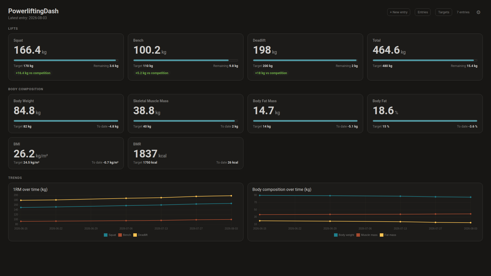
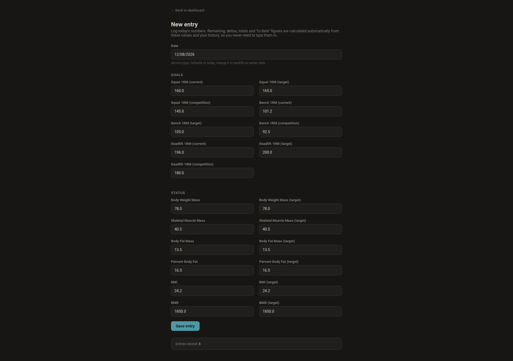
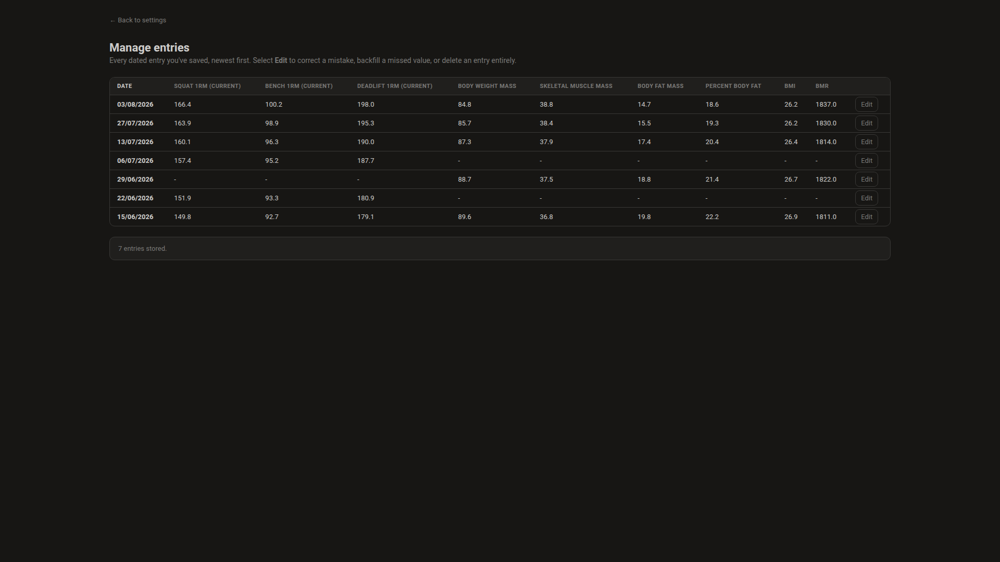
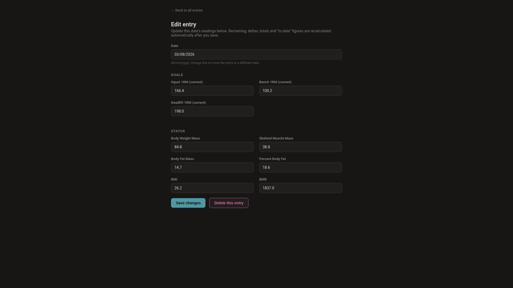
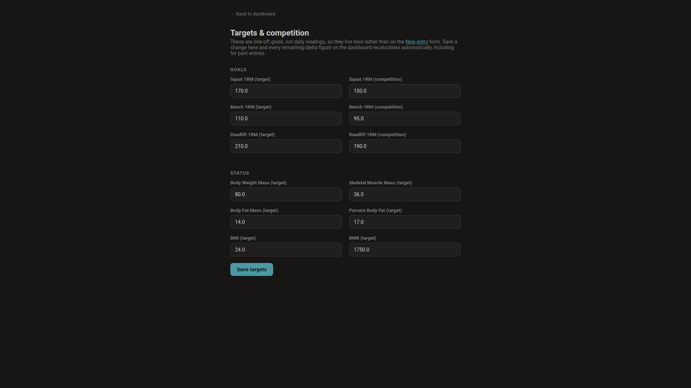
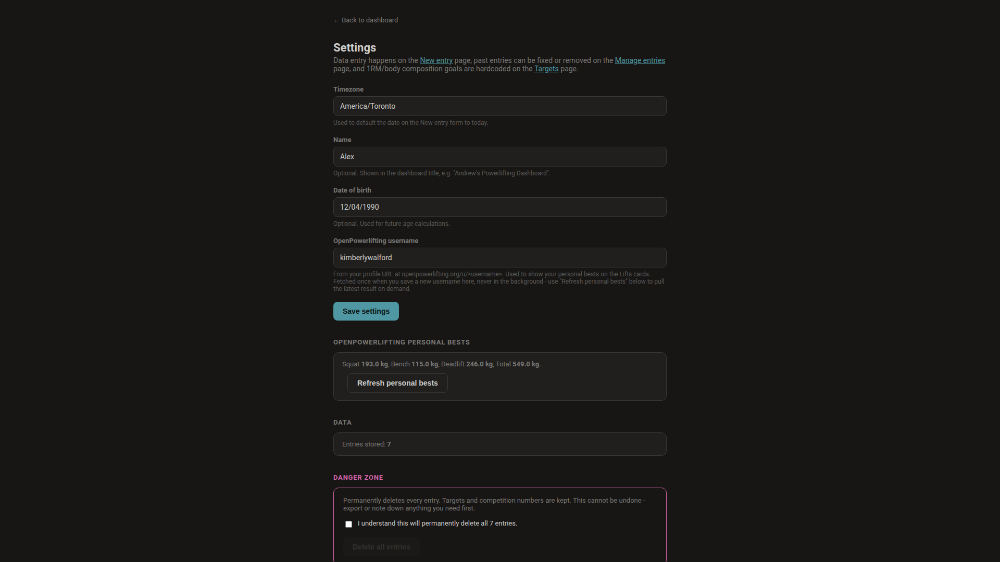
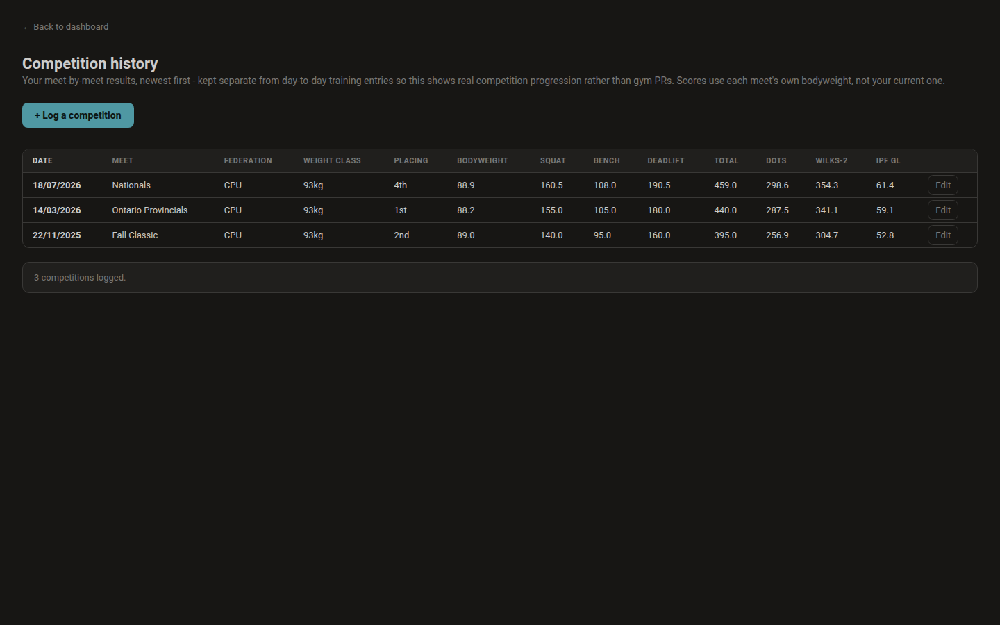
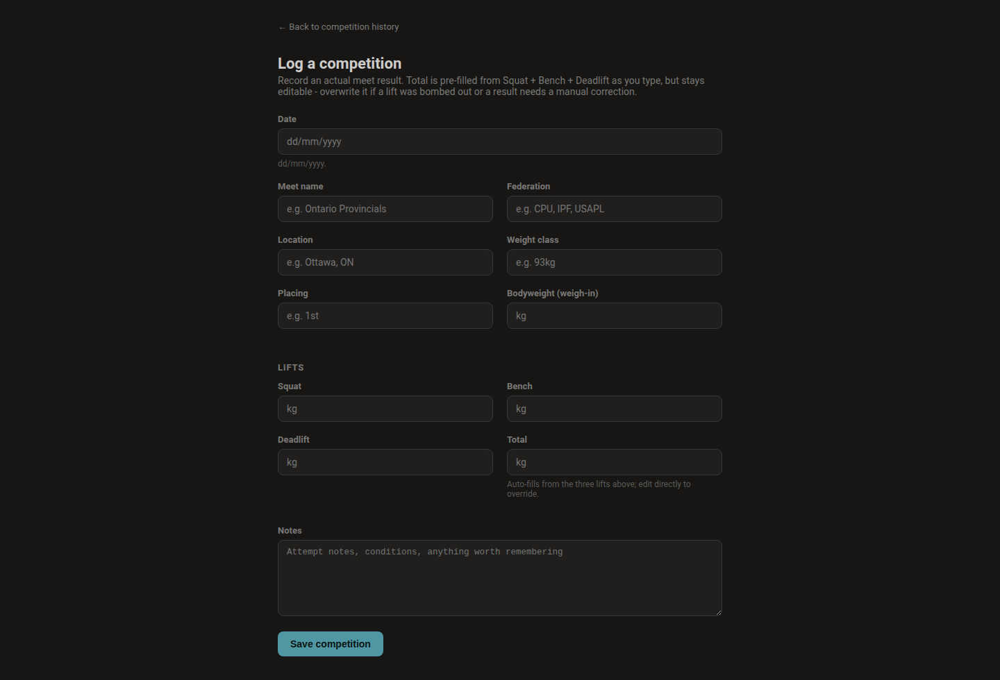
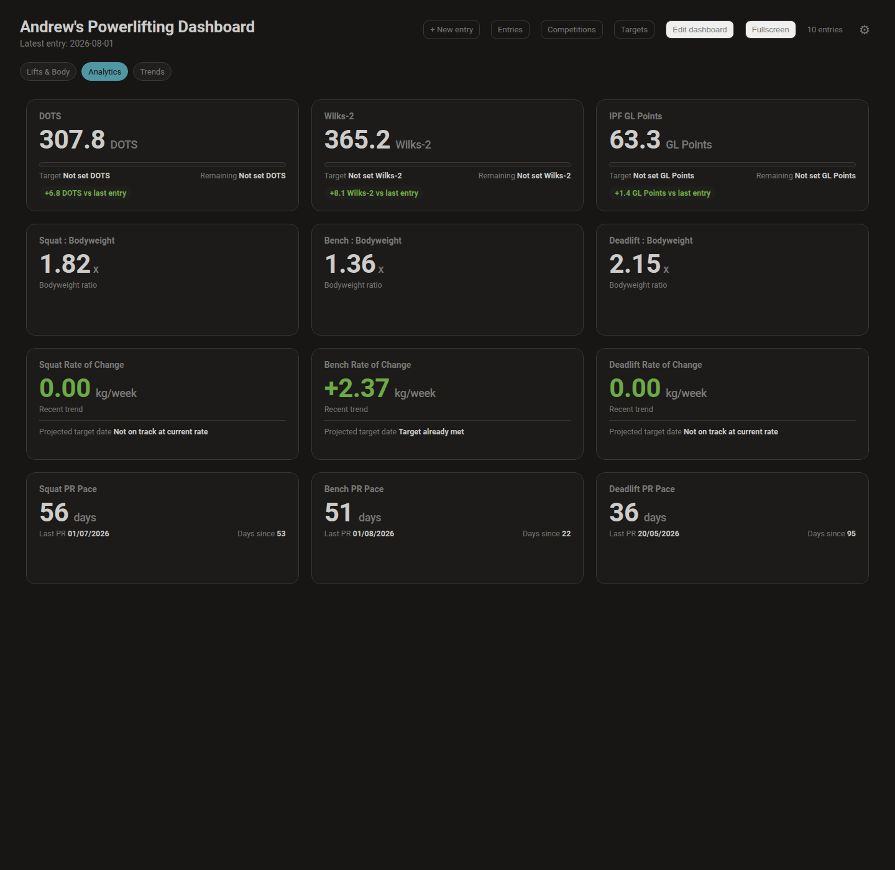

# PowerliftingDash

A slim, self-hosted personal health and powerlifting dashboard, designed to
run full screen on a monitor (kiosk-style).

- **Backend:** Python (FastAPI + SQLite). Runs either as a slimmed-down
  multi-arch Alpine Docker image (works on a Raspberry Pi or a regular
  amd64 machine) or natively as a systemd service on a Linux VM (AWS,
  GCP, Azure, or any other IaaS host) - see "Running it" below.
  Both modes are driven by the same environment variables and the same
  `python3 -m app` entry point, so behaviour is identical either way.
- **Frontend:** server-rendered dark dashboard, vanilla JS + a locally
  vendored copy of Chart.js (no CDN calls at runtime, so it works offline
  once built).
- **Data entry and Google Health:** the **New entry** page (`/entries/new`)
  is the primary place for powerlifting and smart-scale readings. An optional
  Google Health connection can synchronise selected activity, cardio, sleep,
  weight and body-fat measurements without overwriting manual entries.
  Everything derivable
  (remaining, competition deltas, totals, "to date" figures) is calculated
  automatically and never typed in by hand. Past entries can be corrected
  or removed on the **Manage entries** page (`/entries`).
- **Storage:** SQLite, one `entries` row per calendar date (primary key is
  a UUID, generated once per date and kept stable across edits).
- **Targets and competition numbers (hardcoded goals):** your 1RM targets,
  1RM competition numbers, and body-composition/BMI/BMR targets are set
  once on the **Targets** page (`/targets`), not typed in with every dated
  entry. They live as scalar columns on a single `app_settings` row rather
  than on `entries` - see "Targets vs daily entries" below.
- **Personal profile and OpenPowerlifting personal bests:** your name, date
  of birth, and openpowerlifting.org username are set once on the
  **Settings** page (`/settings`). The username, if set, is used to fetch
  your personal-best squat/bench/deadlift/total directly from your public
  openpowerlifting.org profile - see "OpenPowerlifting personal bests"
  below.
- **Competition history:** actual meet results (federation, meet name,
  location, placing, bodyweight, lift attempts, total) are logged
  separately from day-to-day training entries on the **Competitions**
  page (`/competitions`), since a meet result is a one-off record rather
  than something you edit every session. Each row shows its own DOTS,
  Wilks-2 and IPF GL score, calculated from that meet's own bodyweight
  rather than your current one. A **Sync from OpenPowerlifting** button
  on the same page can pull your full meet-by-meet history straight from
  your public profile instead of typing every meet in by hand - see
  "Syncing competition history from OpenPowerlifting" below.
- **PR pace:** the Analytics screen shows average days between personal
  records for squat, bench and deadlift, alongside the date of the most
  recent PR and days since, so plateaus and breakthroughs are visible over
  a longer horizon than the week-to-week rate-of-change widgets.
- **Event countdowns:** upcoming meets, camps or trials can be logged with a
  name, date and optional location on the **Competitions** page
  (`/competitions`), separate from actual results since a countdown is
  planned ahead of time rather than logged after the fact. A dedicated
  **Countdowns** dashboard screen shows the next few events at a glance -
  see "Event countdowns" below.

## Screenshots

All screenshots below are running against eight weeks of made-up demo data
(a fictional powerlifter cutting body fat while building toward a target
total), seeded straight into a scratch database purely to illustrate the
layout - none of it is real training or health data.

**Dashboard** - lift progress bars, body composition, and trend charts:



**New entry** - the primary way numbers get into the app:



**Manage entries** - review, edit or delete a past dated entry:



**Edit entry** - correct a mistake or backfill a missed value on an existing
dated entry:



**Targets** - 1RM targets, competition numbers and body-composition goals,
set once rather than typed in with every dated entry:



**Settings** - your name, date of birth, OpenPowerlifting username and
personal bests, timezone, entry count, and the danger zone:



**Competition history** - actual meet results, kept separate from training
entries, each scored with its own bodyweight:



**Log a competition** - total auto-fills from squat, bench and deadlift but
stays editable for a bombed attempt or manual correction:



**Analytics with PR pace** - average days between personal records for each
lift, alongside the score widgets:



## How the schema was built

The SQLite schema was generated from the **v1** tab of a Google Sheet data
dictionary (Area / Item / Description / Measurement-Type / "Configured in
Settings as Manual Input?" / "Read from New Date Entry?") used only as a
one-time source for column definitions - the app itself has no live
connection to that or any other spreadsheet. Every Item on that tab became
exactly one column, split across two tables by what kind of value it is:

- **`entries`** (32 columns) - anything that changes with a dated
  reading: the 9 daily manual inputs (squat/bench/deadlift 1RM current,
  body weight/muscle/fat mass, body fat %, BMI, BMR) plus the 23 columns
  `derive.py` computes from them (remaining, competition deltas, totals,
  "to date" figures).
- **`app_settings`** (12 columns from the v1 sheet, plus 9 hardcoded
  columns added later - see below) - the target and competition items,
  which describe a goal rather than a dated reading: squat/bench/deadlift
  1RM target and competition, and the target for body weight/muscle/fat
  mass, body fat %, BMI and BMR. These are set once on `/targets`, stored
  as a single scalar row, and read by `derive.py` as a snapshot applied
  uniformly across every historical entry - see "Targets vs daily
  entries" below.

A further **9 columns** on `app_settings` - `display_name`,
`date_of_birth`, `openpowerlifting_username`, `opl_best_squat`,
`opl_best_bench`, `opl_best_deadlift`, `opl_best_total`, `opl_fetched_at`,
`opl_fetch_error` - are not driven by the v1 sheet at all. They're
hardcoded in `schema/generate_schema.py` alongside `timezone`, the same
way that column was added: a personal-profile and integration field that
has no equivalent "Area / Item" row in the original data dictionary.
`db._ensure_settings_columns()` adds them to any pre-existing database on
startup, the same idempotent way `_ensure_config_columns()` already
handled the `/targets` split.

`schema/generate_schema.py::is_config_item()` does this split by checking
for a strict `(target)` or `(competition)` suffix on the Item name. It
deliberately excludes `(competition delta)` and "Total Weight Lifted (in
competition)", which are derived status figures, not goals, and stay on
`entries`.

- `schema/v1_items.csv` - a checked-in copy of the v1 tab, kept as the
  source of truth for column generation.
- `schema/generate_schema.py` - regenerates `app/schema.sql` and
  `app/schema_manifest.json` from that CSV. Re-run it if the CSV changes:
  ```bash
  python3 schema/generate_schema.py
  ```

## Logging your daily entry (primary workflow)

1. Open `/entries/new` (there's a **+ New entry** link on the dashboard's
   top bar).
2. The date field defaults to today, in `dd/mm/yyyy` format - change it if
   you're backfilling an earlier date. Dates are parsed with an explicit
   dd/mm/yyyy format, never guessed, so they're never silently misread.
3. Every field is pre-filled with your most recent entry's values, grouped
   by area (Goals / Status), so you usually only need to change the one or
   two numbers that actually moved.
4. Fill in the Lifts section, the Body composition section, or both - a
   section left blank is simply not recorded for that date rather than
   rejected, so a gym day and a weigh-in day don't have to be the same
   day. At least one value somewhere on the form is required.
5. Hit **Save entry**. All derived columns (remaining, competition deltas,
   totals, "to date" figures) are recalculated for every stored date - not
   just the one you just saved - so backfilling an earlier date always
   keeps history consistent.

Target and competition fields do not appear on this form, and posting
one to `/api/entries` is rejected with a `400` pointing you to `/targets`
instead - see the next section.

## Managing past entries

Open `/entries` (there's an **Entries** link on the dashboard's top bar,
and a link from `/settings`) to see every stored date, newest first.

- **Edit** an entry to open it in the same form used for new entries, with
  its existing values pre-filled. Saving an edit replaces that entry's
  full set of values - clearing a field and saving removes that value from
  the entry rather than leaving the old number in place. At least one
  value must remain, and changing the date to one that already has an
  entry is rejected with a `400` telling you to edit that entry instead.
- **Delete** a single entry from its edit page.
- **Delete every entry** from the danger zone on `/settings` - this
  requires ticking an "I understand" confirmation checkbox before the
  button is enabled, and cannot be undone. Targets and competition
  numbers are untouched, since they live on a separate `app_settings` row.

## Setting your targets and competition numbers

Your 1RM targets, 1RM competition numbers, and body-composition/BMI/BMR
targets are goals, not daily readings, so they live on their own page
rather than on `/entries/new`:

1. Open `/targets` (there's a **Targets** link on the dashboard's top bar
   and on `/settings`).
2. Fields are grouped by area and pre-filled with whatever you last
   saved. Leave a field blank to leave it unset.
3. Hit **Save targets**. This writes to a single `app_settings` row (via
   `db.update_config()`), then calls `derive.recompute_all()`, so every
   stored entry's remaining/delta figures update immediately to reflect
   the new goal - not just entries you save from now on.

Because they're config rather than per-date data, target and competition
values are intentionally excluded from `/entries/new`: posting one there
returns a `400` telling you to use `/targets` instead.

## OpenPowerlifting personal bests

If you compete, PowerliftingDash can show your all-time personal-best
squat/bench/deadlift/total next to each lift card, sourced directly from
your public profile on [openpowerlifting.org](https://www.openpowerlifting.org/):

1. Open `/settings` and enter your openpowerlifting.org username (the part
   of your profile URL after `/u/`, e.g. `andrewhay` for
   `openpowerlifting.org/u/andrewhay`).
2. Hit **Save settings**. If the username is new or has changed,
   PowerliftingDash fetches your best-lifts table there and then, and
   stores the Raw-equipment squat/bench/deadlift/total on `app_settings`
   (`app/openpowerlifting.py::fetch_personal_bests()`). Saving again with
   the same username does not re-fetch.
3. Use the **Refresh personal bests** button on `/settings`
   (`POST /api/openpowerlifting/refresh`) any time you want to pull an
   updated result, e.g. after a new competition is added to the database.

Notes and failure modes:

- OpenPowerlifting is one of two optional outbound integrations. Its request
  is an explicit, on-demand `GET` against a public profile page, triggered
  only by a Settings save or a Refresh click. Google Health also runs only
  inline with a Settings, sync, or eligible dashboard request. Neither uses a
  background job or scheduled polling.
- openpowerlifting.org has no public JSON API for a single lifter, so
  `app/openpowerlifting.py` parses the small best-lifts table at the top
  of the profile page with the standard library's `html.parser` (no
  third-party HTML/XML packages are used).
- If a username matches more than one lifter, openpowerlifting.org serves
  a disambiguation page instead of a profile; PowerliftingDash detects
  this and surfaces a message suggesting the numbered usernames shown on
  that page (e.g. `joshuabaker1`, `joshuabaker2`).
- If the username is wrong, unreachable, or the page can't be parsed, the
  settings save still succeeds - your other fields are stored - but the
  response includes an `openpowerlifting_warning`, which `settings.js`
  surfaces as an inline warning, and the failure reason is stored in
  `app_settings.opl_fetch_error` for later inspection.
- Personal bests are always in kilograms, matching every other weight
  figure in the app, and prefer the "Raw" equipment row when a lifter has
  results in more than one equipment category.

## Syncing competition history from OpenPowerlifting

If your meets are already on openpowerlifting.org, you don't have to
re-type every date, meet name and lift into `/competitions/new` by hand:

1. Set your openpowerlifting.org username on `/settings` (the same one
   used for personal bests above).
2. Open `/competitions` and click **Sync from OpenPowerlifting**.
3. PowerliftingDash fetches your profile's full Competition Results table
   (`app/openpowerlifting.py::fetch_competition_history()`), not just the
   best-lifts summary, and posts it to
   `POST /api/competitions/sync-openpowerlifting`.
4. Each fetched meet is compared against your existing rows by
   competition date, meet name and total (case-insensitive on the name).
   Meets that already match an existing row are skipped; only genuinely
   new meets are inserted. The button's status line reports how many were
   imported and how many were already up to date.

Notes and failure modes:

- Sync is additive and read-only towards your existing data: it never
  updates, overwrites or deletes a competition row you've already logged,
  even if the OpenPowerlifting figures differ slightly (for example a
  meet result corrected after the fact). If you want to fix an imported
  row, edit it on `/competitions` as normal afterwards.
- If you're entered in more than one division at the same meet on the
  same date with the same total (for example Open and a Masters age
  category), both divisions are imported separately, since they're
  genuinely different results, not duplicates.
- Disqualified (`DQ`) attempts are imported with a `DQ` placing and blank
  lift/total figures, matching what OpenPowerlifting itself shows.
- Like personal bests, sync is a single on-demand `GET` against your
  public profile, triggered only by clicking the button - there is no
  background job or scheduled polling.
- If no username is set, the button returns a `400` telling you to set
  one on `/settings` first. If the username is wrong, unreachable, or
  ambiguous, the same disambiguation and "lifter not found" handling used
  for personal bests applies, and the failure is shown inline rather than
  silently discarding your click.

## Event countdowns

Above the competition history table on `/competitions` is a **Countdowns**
section for events that haven't happened yet - a national qualifier, a
training camp, a trial, anything worth watching the clock for.

- **Add a countdown:** click **+ Add countdown** and fill in an event name
  and date (`dd/mm/yyyy`). Country, province/state and city are optional and
  chosen from dropdowns rather than typed freehand, so location text stays
  consistent across events.
- **Manage locations:** click **Manage locations** to add or remove the
  country, province/state and city options that appear in those dropdowns.
  This list is self-maintained - there's no bundled global geography
  dataset - so it only ever contains places you actually use. Removing a
  location option never touches countdowns that already used it; the saved
  value stays on that row.
- **Upcoming and past:** the table sorts upcoming events soonest-first,
  followed by past events most-recent-first at reduced opacity, each with
  its computed "time until" (or "time since") the event date.
- **Dashboard widget:** a dedicated **Countdowns** screen on the main
  dashboard (`/`) shows the next few upcoming events as cards, with a link
  back to `/competitions` for the full list including past events. "Today"
  for the countdown calculation uses your configured timezone from
  `/settings`, not server UTC time.
- Editing or deleting a countdown works the same way as competition rows -
  inline **Edit**/**Delete** links on each table row, no separate page.

## Google Health integration

PowerliftingDash can connect to the Google Health API for four optional data
categories: body composition, activity and steps, heart and cardio, and sleep
and recovery. Connection and synchronisation happen only following an explicit
Settings action, a manual **Sync now** click, or a dashboard request after the
configured refresh interval. There is no background worker or scheduled
polling.

### Setup

1. In Google Cloud, create an OAuth 2.0 web application client and add this
   redirect URI: `<PLD_PUBLIC_BASE_URL>/google-health/oauth/callback`.
2. In `/settings`, enter the client ID and client secret, then choose **Save
   and connect**. The secret is stored in the local SQLite database and is
   never returned by the settings API.
3. During personal use, leave the OAuth consent screen in **Testing** and add
   your own Google account as a test user. The three Google Health scopes are
   Restricted, but a single personal test user does not need a security review.
4. Approve the requested read-only scopes. The callback performs the first
   historical synchronisation, which defaults to 730 days, then future syncs
   are incremental.

The integration stores daily activity, cardio and sleep information in a
separate `health_metrics` table. Weight and body-fat samples only fill a field
that is blank on an `entries` row, so a manual reading is never replaced.
Height is saved as the latest informational Google Health value. Google Health
does not currently supply BMR, so BMR remains a manual smart-scale entry.

`PLD_PUBLIC_BASE_URL` defaults to `http://localhost:<PLD_PORT>`, which suits
local OAuth development. A public deployment should set it to the real HTTPS
address. `PLD_GOOGLE_HEALTH_SYNC_INTERVAL_SECONDS` defaults to 3600 and limits
request-triggered dashboard refreshes.

## Running it

PowerliftingDash runs the same code either as a Docker container or as a
native systemd service on a plain Linux host - pick whichever suits where
you're putting the monitor. Both modes read the same environment
variables (`PLD_DATA_DIR`, `PLD_DB_FILENAME`, `PLD_HOST`, `PLD_PORT`,
`PLD_DASHBOARD_POLL_SECONDS`, `PLD_PUBLIC_BASE_URL`, and
`PLD_GOOGLE_HEALTH_SYNC_INTERVAL_SECONDS`) through the same `python3 -m app` entry
point (`app/__main__.py`), so there's no behavioural difference between
the two beyond how the process is supervised.

### Option A: Docker (a Raspberry Pi or small always-on box by the monitor)

```bash
# Build and run with Docker Compose (recommended)
docker compose up --build -d
```

Or with plain Docker, targeting a Raspberry Pi (arm64):

```bash
docker buildx build --platform linux/arm64 -t powerliftingdash:latest --load .
docker run -d --name powerliftingdash \
  -p 8080:8080 \
  -v powerliftingdash-data:/data \
  -e TZ=America/Toronto \
  powerliftingdash:latest
```

Then open `http://<host>:8080/` full screen on the monitor. Log your
first entry at `http://<host>:8080/entries/new` - no other configuration
is required.

#### Multi-architecture builds

The `Dockerfile` builds cleanly for both `linux/amd64` and `linux/arm64`.
To build and push a multi-arch manifest to a registry:

```bash
docker buildx build --platform linux/amd64,linux/arm64 \
  -t <your-registry>/powerliftingdash:latest --push .
```

### Option B: native install on a Linux VM (AWS, GCP, Azure, or any IaaS host)

No Docker required - this installs Python, a virtual environment and a
systemd service directly on the host. Tested against Ubuntu/Debian and
Amazon Linux/RHEL family images, the two most common defaults on EC2,
Compute Engine and Azure VMs.

```bash
git clone https://github.com/andrewsmhay/PowerliftingDash.git
cd PowerliftingDash
sudo ./deploy/install.sh
```

You don't need to install anything yourself first - the script installs
every OS package it needs (Python 3.10+, pip, rsync, git) before doing
anything else. On Amazon Linux and other RHEL-family/Fedora hosts the
plain `python3` package stays on an old release for the life of the OS
(3.9 on Amazon Linux 2023), so the script specifically looks for a
versioned package new enough for PowerliftingDash (`python3.12`,
`python3.11`, and so on) rather than assuming `python3` is recent enough.

This creates a dedicated `powerliftingdash` system user, installs the app
to `/opt/powerliftingdash` with its own virtual environment, stores the
SQLite database under `/var/lib/powerliftingdash`, writes a starter
config to `/etc/powerliftingdash/powerliftingdash.env`, and enables +
starts a `powerliftingdash.service` systemd unit (auto-restarts on
failure, starts on boot). See `deploy/powerliftingdash.env.example` for
every setting and what it does.

Useful commands once installed:

```bash
systemctl status powerliftingdash     # is it running?
systemctl restart powerliftingdash    # after editing the env file
journalctl -u powerliftingdash -f     # tail the logs
```

#### Updating a native install

Re-run the same install script from an updated checkout; it resyncs the
code, reinstalls dependencies and restarts the service. It never
overwrites your `/etc/powerliftingdash/powerliftingdash.env`, so any
custom host/port/data-directory settings survive the update:

```bash
cd PowerliftingDash && git pull
sudo ./deploy/install.sh
```

To remove it entirely: `sudo ./deploy/uninstall.sh` (add `--purge-data`
to also delete the SQLite database).

#### Prefer to run it by hand instead of the install script?

```bash
python3 -m venv .venv && . .venv/bin/activate
pip install -r requirements.txt
PLD_DATA_DIR=/var/lib/powerliftingdash PLD_PORT=8080 python3 -m app
```

#### Exposing it on a public cloud VM

PowerliftingDash has no login or authentication of any kind - it's built
as a personal, single-user dashboard. Before opening it up on a
cloud host with a public IP:

- **Restrict inbound access at the network layer first.** In your
  provider's firewall (AWS Security Group, GCP firewall rule, Azure
  Network Security Group), only allow the dashboard's port from your own
  IP address or a VPN/tailnet, rather than `0.0.0.0/0`.
- **If you do need it reachable from anywhere**, put a reverse proxy
  (Caddy or nginx) in front of it on 80/443 with TLS and HTTP basic auth,
  and only expose 80/443 publicly - keep port 8080 itself closed to the
  internet.
- The DHCP-assigned private/public IP of the VM doesn't need any
  dashboard-side configuration either way, since `PLD_HOST=0.0.0.0`
  already listens on every interface the host has.

## Project layout

```
app/
  __main__.py        Shared entry point for Docker and native (`python3 -m app`)
  main.py            FastAPI app, startup/shutdown hooks
  config.py          Environment-driven configuration (same env vars, both deployment modes)
  db.py              SQLite access, upsert/edit/delete logic, app_settings config
  numeric.py         Shared numeric string coercion for the manual entry form
  derive.py          Computes all "read from new date entry" columns from a config snapshot
  date_utils.py      Explicit dd/mm/yyyy date parsing
  formatting.py      Dashboard title formatting (possessive display name)
  openpowerlifting.py Fetches personal bests from openpowerlifting.org
  google_health.py   OAuth and data normalisation for Google Health
  metrics.py         Raw entry row + config -> dashboard card/chart payload
  routes/            Page routes (dashboard, entries, targets, settings, competitions, countdowns) and JSON API
  templates/         Jinja2 templates (dashboard, entry_form, entries_list, targets, settings, competitions_list, competition_form)
  static/            CSS, JS, vendored Chart.js
  schema.sql, schema_manifest.json   Generated - do not hand-edit
schema/
  v1_items.csv        Source-of-truth data dictionary
  generate_schema.py   Regenerates the schema from the CSV above; splits entries vs app_settings
tests/                 pytest unit tests, including Google Health client, migration, and route coverage
deploy/
  install.sh                        Installs/updates PowerliftingDash as a native systemd service
  uninstall.sh                      Removes the native install
  powerliftingdash.env.example      Template for /etc/powerliftingdash/powerliftingdash.env
  systemd/powerliftingdash.service  systemd unit installed by install.sh
Dockerfile             Multi-stage, slim Alpine, multi-arch
docker-compose.yml
```

## Tests

```bash
python3 -m venv .venv && . .venv/bin/activate
pip install -r requirements.txt pytest
python3 -m pytest tests/ -v
```

## Notes and assumptions

- **Manual entry remains authoritative for daily readings.** The
  `/entries/new` web form is the source for powerlifting and smart-scale
  values. Google Health may only gap-fill weight and body-fat fields, and
  keeps activity, cardio and sleep measurements in `health_metrics`. Both
  Google Health and OpenPowerlifting work only during a user-triggered request;
  there is no background job or scheduled sync process.
- The v1 tab's "Configured in Settings as Manual Input?" column drives
  which columns appear on the `/entries/new` form (`configured_in_settings`
  in `schema_manifest.json`). The "Read from New Date Entry?" column
  drives which columns `derive.py` computes automatically rather than
  accepting as form input - both live on the same `entries` table.
- **BMI and BMR are manual smart-scale readings**, not formulas. The
  schema has no height, age or sex fields, so BMI/BMR current and target
  are entered directly (from a smart scale) rather than derived from
  other columns.
- **Weight Change Since Comp** is derived as
  `body_weight_mass - earliest recorded body_weight_mass`, since there is
  no dedicated competition-weigh-in field in the 44-item schema. Every
  other `_to_date` column follows the same "current minus earliest
  non-null historical value" convention.
- `derive.recompute_all()` reloads every entry oldest-first and
  recomputes every derived column on every row each time it runs (after
  every manual save, edit or delete). This is what keeps "to date"
  baselines correct if you ever backfill, edit or remove an earlier date
  after later ones already exist.
- A future v2 metric set (MyFitnessPal macros, event countdown) is not yet
  wired into the schema; extend `schema/v1_items.csv` and re-run
  `schema/generate_schema.py` to add it.
- **Upgrading an existing database for the `/targets` split:** older
  databases stored target/competition values as columns on `entries`.
  `db.init_db()` runs two migration steps automatically on startup, so
  nothing manual is required on your Pi:
  1. `_ensure_config_columns()` - idempotent `ALTER TABLE app_settings ADD
     COLUMN` for each of the 12 target/competition columns, safe to run
     on every startup (it checks the existing column list first).
  2. `_backfill_config_from_latest_entry()` - a one-time seed: if
     `app_settings`'s target/competition columns are still `NULL` and
     your old `entries` table still has legacy target/competition
     columns, it copies the values from your most recent entry into
     `app_settings` so your existing goals aren't lost. It's a no-op on
     fresh installs and on any database that's already migrated.

  After upgrading, open `/targets` once to confirm your goals carried
  over correctly, and adjust anything that didn't.
- **Upgrading an existing database for the personal profile and
  OpenPowerlifting fields:** `db.init_db()` also runs
  `_ensure_settings_columns()` on every startup, an idempotent `ALTER
  TABLE app_settings ADD COLUMN` for the 9 columns listed in "How the
  schema was built" above (`display_name`, `date_of_birth`,
  `openpowerlifting_username`, and the six `opl_*` fields). Like
  `_ensure_config_columns()`, it checks the existing column list first, so
  it's a no-op on any database that already has them. There is no
  backfill step for these columns - they simply start `NULL` until you
  fill them in on `/settings`.
